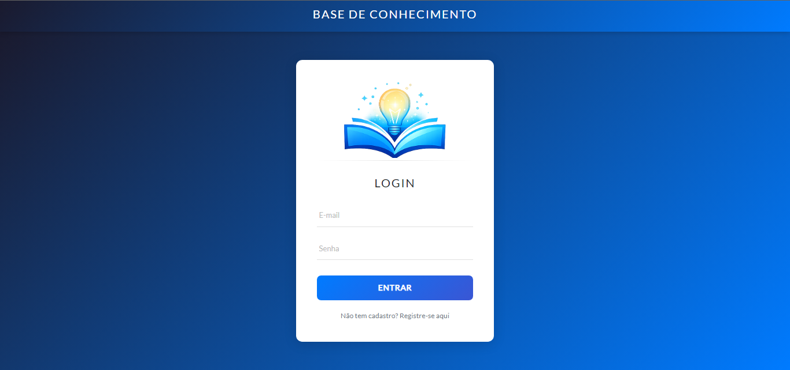
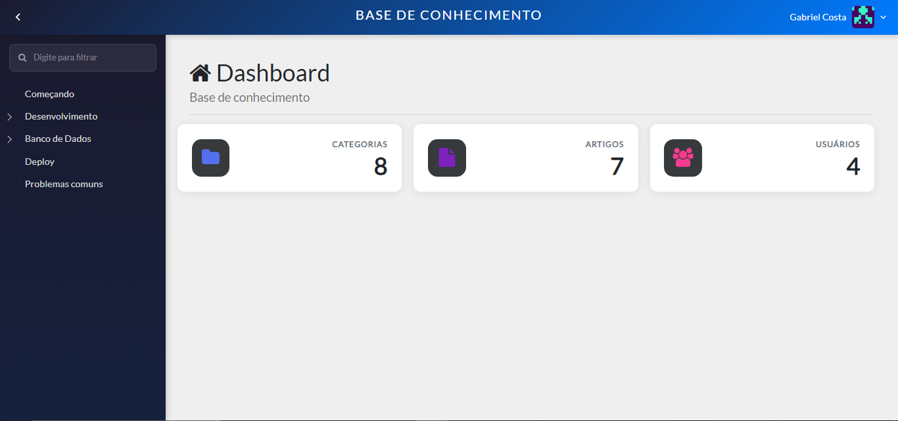
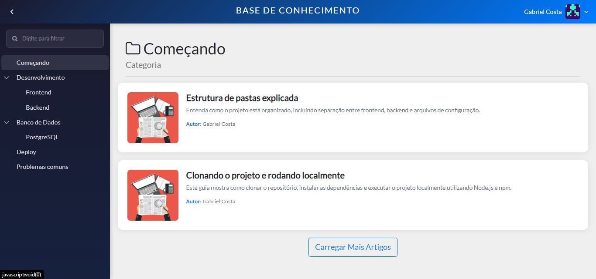
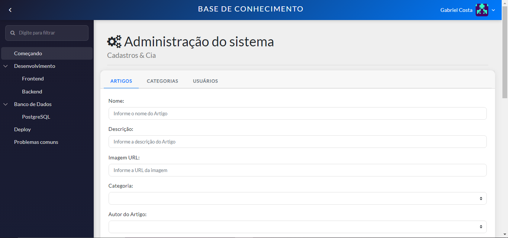

# 📚 Knowledge Base

Aplicação fullstack de base de conhecimento, onde usuários podem navegar por categorias e artigos, e administradores podem gerenciar todo o conteúdo pelo painel admin.

> Projeto desenvolvido para portfólio com foco em boas práticas de desenvolvimento web fullstack.

---

## 📸 Screenshots






---

## 🚀 Tecnologias

### Frontend
- **Vue.js 2** — framework JavaScript progressivo
- **Vuex** — gerenciamento de estado global
- **Vue Router** — navegação entre páginas com guards de rota
- **Bootstrap Vue** — componentes de UI responsivos
- **Axios** — requisições HTTP com interceptors

### Backend
- **Node.js** com **Express** — servidor e API REST
- **PostgreSQL** — banco de dados relacional (artigos, categorias, usuários)
- **MongoDB** — banco de dados não relacional (estatísticas em tempo real)
- **Knex.js** — query builder e migrations
- **JWT** — autenticação stateless com tokens
- **Bcrypt** — criptografia de senhas
- **Passport.js** — middleware de autenticação
- **Node Schedule** — agendamento de tarefas automáticas

---

## ✨ Funcionalidades

- 🔐 Autenticação com JWT (login, cadastro, validação de token)
- 👤 Controle de acesso por perfil (admin e usuário comum)
- 📁 Navegação por categorias em árvore hierárquica
- 📄 Leitura de artigos com highlight de código
- 📊 Dashboard com estatísticas em tempo real
- ⚙️ Painel admin para gerenciar artigos, categorias e usuários
- 🔄 Estatísticas atualizadas automaticamente a cada minuto via scheduler

---

## 🗂️ Estrutura do Projeto

```
knowledge-base/
├── backend/
│   ├── api/          # Lógica de negócio (articles, categories, users...)
│   ├── config/       # Configurações (db, passport, middlewares, rotas)
│   ├── migrations/     # Controle do banco de dados
│   ├── schedule/     # Agendamento de estatísticas
│   └── index.js      # Entrada da aplicação
│
└── frontend/
    ├── src/
    │   ├── assets/
    │   ├── components/
    │   │   ├── admin/     # Painel administrativo
    │   │   ├── article/   # Listagem e leitura de artigos
    │   │   ├── auth/      # Login e cadastro
    │   │   ├── home/      # Dashboard
    │   │   └── template/  # Componentes base (Header, Menu, Footer...)
    │   ├── config/        # Axios, store, router, bootstrap...
    │   └── App.vue
    └── public/
```

---

## ⚙️ Como rodar localmente

### Pré-requisitos
- Node.js 16+
- PostgreSQL
- MongoDB

### Backend

```bash
# Entre na pasta do backend
cd backend

# Instale as dependências
npm install

# Configure as variáveis de ambiente
# Crie um arquivo .env com:
# authSecret=sua_chave_secreta

# Configure o banco no knexfile.js
# e rode as migrations
npx knex migrate:latest

# Inicie o servidor
node index.js
```

### Frontend

```bash
# Entre na pasta do frontend
cd frontend

# Instale as dependências
npm install

# Inicie a aplicação
npm run serve
```

A aplicação estará disponível em `http://localhost:8080`

---

## 🔑 Variáveis de Ambiente

### Backend — `.env`
| Variável | Descrição |
|----------|-----------|
| `authSecret` | Chave secreta para geração dos tokens JWT |


## 👨‍💻 Autor

**Gabriel Costa**  
[](https://github.com/gabrielcostaw)

---

